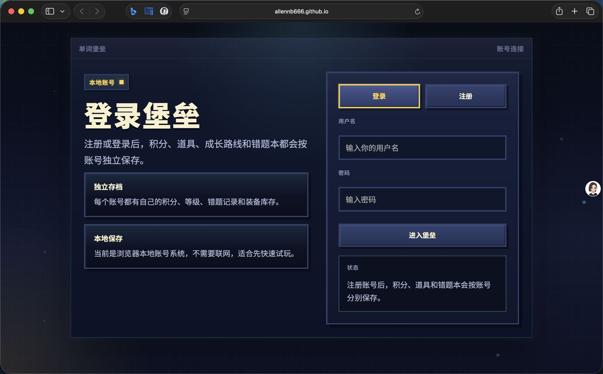

# Fortress

一个把英语单词练习、像素塔防和成长系统结合在一起的浏览器小游戏。

## 在线试玩

- 试玩地址: [https://allennb666.github.io/Fortress/](https://allennb666.github.io/Fortress/)
- GitHub 仓库: [https://github.com/Allennb666/Fortress](https://github.com/Allennb666/Fortress)



## 项目简介

`Fortress` 的核心玩法是:

- 怪物会沿着多条路线逼近基地
- 每个怪物身上带着英文单词
- 玩家输入正确的中文翻译来击退怪物
- 漏掉的单词会进入错题本，后续可以专项练习和复盘

它不是传统塔防里“摆塔自动打怪”的模式，而是把打字、记单词和防守节奏结合到了一起，更像一个带战斗表现、局外成长和复习闭环的词汇训练游戏。

## 主要特色

- 像素风界面和战斗反馈
- 简单 / 中等 / 困难 三档难度
- 自定义词库模式
- 错题本与错题练习模式
- 局后单词复盘，可以查看本局命中、漏怪和得分情况
- 等级、经验与成长路线系统
- 堡垒升级系统，可强化基地血量、冻结时长和连击收益
- 商店与补给系统，支持秒杀、冻结、清屏等主动或被动道具
- 连击收益和失误减速机制，让战斗节奏更有变化
- 基于浏览器本地存储保存账号、积分、道具和错题进度

## 当前版本亮点

- 首页加入了更完整的主菜单信息，包括等级、最高连击、补给概览和错题状态
- 增加了堡垒升级界面，可以用累计成长资源逐步强化防守能力
- 增加了经验路线页，能看到当前等级、经验进度和后续成长节点
- 商店和战斗系统更完整，冻结脉冲、清屏炸弹和秒杀补给都能直接影响战局
- 错题本展示更详细，能看到释义、例句、接受答案和最近出错时间
- 每局结束后会显示单词复盘，方便知道哪些词需要继续练

## 怎么玩

- 选择难度后开始战斗
- 观察逼近基地的英文单词
- 在输入框中输入对应的中文翻译并发射
- 利用连击、冻结、清屏和秒杀来守住基地
- 结束后查看复盘，并把漏掉的词带回错题本继续练习

## 本地运行

建议使用 Node.js `20.19.0` 或更高版本。

```bash
npm install
npm run dev
```

开发服务器默认会启动在:

```text
http://localhost:5173
```

如果你想本地预览生产构建:

```bash
npm run build
npm run preview
```

## 技术栈

- React
- Vite
- JavaScript
- GitHub Pages

## 仓库说明

- `src/App.jsx`: 游戏主逻辑与主要界面
- `src/gameData.js`: 单词数据、商店道具和基础配置
- `src/styles.css`: 视觉样式
- `.github/workflows/deploy.yml`: GitHub Pages 自动部署工作流

## 部署

这个项目已经配置为通过 GitHub Actions 自动部署到 GitHub Pages。推送到 `main` 分支后，会自动重新发布站点。
